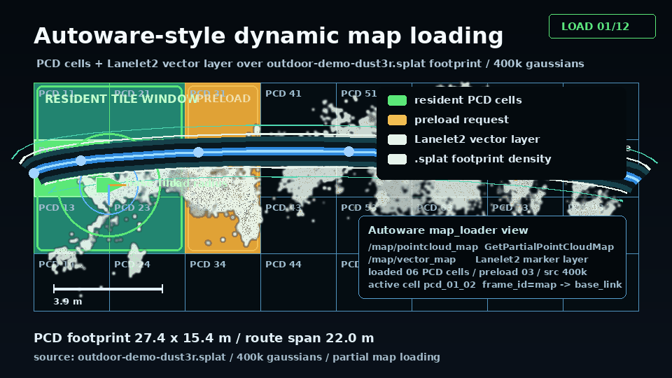
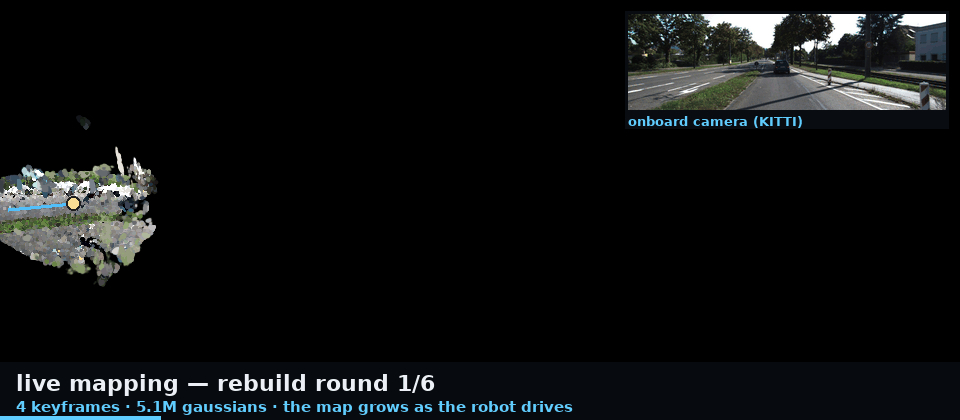

# 3DGS Robotics

[](https://github.com/rsasaki0109/3dgs-robotics/actions/workflows/ci.yml)
[](LICENSE)
[](https://huggingface.co/spaces/rsasaki0109/3dgs-robotics)
[](https://colab.research.google.com/github/rsasaki0109/3dgs-robotics/blob/main/notebooks/photos_to_splat_colab.ipynb)

**Real outdoor robot logs -> browser 3D Gaussian Splats -> Physical AI scenario CI.**

3DGS Robotics turns photos, videos, rosbags, and external SLAM outputs into browser
`.splat` scenes, then feeds the same catalog into route-policy benchmarks and
scenario CI.

**Try it first:** [build your own splat — zero install (HF Spaces)](https://huggingface.co/spaces/rsasaki0109/3dgs-robotics) |
[live 3DGS demo](https://rsasaki0109.github.io/3dgs-robotics/splat.html) |
[large-scale Dynamic Map Viewer](https://rsasaki0109.github.io/3dgs-robotics/dreamwalker/?tileCatalog=%2Fmanifests%2Foutdoor-production-grid-large-tile-catalog.json&tilePreload=metadata&tilePreloadLimit=4&tileResidentLimit=6&robotRoute=%2Frobot-routes%2Foutdoor-production-grid-large-route.json&robotRoutePlayback=1&robotRoutePlaybackMs=1200&robotRoutePlaybackLoop=1)

[](https://rsasaki0109.github.io/3dgs-robotics/)

Lead GIF: dynamic map loading on real robot data — the base layer is a true top-down (orthographic gsplat) render of the Istanbul Bag6 rosbag2 pilot scene, and the resident (green) / preload (amber) tile window moves along the camera trajectory recovered from the mapped street, so 30 m map tiles light up as the camera drives. Standalone still: `docs/images/demo-sweep/dynamic-map-material.png`.

```bash
pip install -e ".[dev]"
3dgs-robotics video-to-splat my_drive.mp4 --output outputs/my_drive_splat
3dgs-robotics photos-to-splat --images ./my_photos --output outputs/my_splat
```

What ships: nine public outdoor `.splat` scenes; a large-scale Dynamic Map Viewer
fixture (87 tiles); `video-to-splat` / `photos-to-splat`; VGGT feedforward
preprocess; ROS 2 live mapping + localizer + GS camera simulator nodes; 3DGS
localization against live sessions; Isaac Sim export (NuRec USDZ); nav2
occupancy grid export; `splat-inspect` / `splat-filter`;
Physical AI benchmark + scenario CI tooling. Details: `docs/plan_outdoor_gs.md`,
`docs/live-mapping.md`, `docs/isaac-sim.md`, `docs/physical-ai-sim.md`.

## Quickstart — pick your entry point

| What you start with | Minimum command | Deep-dive section |
| --- | --- | --- |
| **A walkaround video** | `3dgs-robotics video-to-splat my_drive.mp4 --output outputs/my_drive_splat` | [Video to splat](#video-to-splat-one-shot-pose-free) |
| **A folder of photos** | `3dgs-robotics photos-to-splat --images ./my_photos --output outputs/my_splat` | [Bring Your Own Photos](#bring-your-own-photos-one-shot-pose-free) |
| **A rosbag from your robot** | `3dgs-robotics map my_drive_bag/` (one-shot) or `python3 scripts/run_live_mapping_demo.py --bag my_drive_bag/ --port 8765` (live replay) — no ROS install needed | [Live Mapping (ROS 2)](#live-mapping-ros-2--watch-the-map-grow) |
| **External SLAM artifacts** | `python3 scripts/plan_external_slam_imports.py --format shell` then `3dgs-robotics preprocess --method external-slam ...` | [Import External SLAM Results](#import-external-slam-results) |
| **Existing splats for policy evaluation** | `python3 scripts/generate_sim_catalog.py --output docs/sim-scenes.json` then `3dgs-robotics route-policy-benchmark ...` | [Physical AI benchmark path](#physical-ai-benchmark-path) |
| **A live ROS 2 camera topic** | `3dgs-robotics-live-mapper --image-topic /camera/image_raw/compressed --port 8765` | [Live Mapping (ROS 2)](#live-mapping-ros-2--watch-the-map-grow) |
| **Isaac Sim as the target** | `3dgs-robotics export-isaac --map outputs/live_mapping --output scene.usdz` | [docs/isaac-sim.md](docs/isaac-sim.md) |
| **A simulated camera in your map** | `3dgs-robotics-camera-sim --map outputs/live_mapping --replay --loop` | [docs/live-mapping.md](docs/live-mapping.md#ros-2-gs-camera-simulator-node) |
| **nav2 needs a map** | `3dgs-robotics export-grid --map outputs/live_mapping --output nav2_map/map.yaml` | [docs/live-mapping.md](docs/live-mapping.md#nav2-occupancy-grid-export) |
| **Just a browser** | HF Spaces / Colab badges above | [Zero-install demos](#zero-install-demos-hf-spaces--colab) |

Supervised rosbag pipelines and large-scale tiling: [Outdoor pipeline quickstart](#outdoor-pipeline-quickstart-autoware-leo-drive).

## Live Demo

| URL | Renderer |
| --- | --- |
| [`/splat.html`](https://rsasaki0109.github.io/3dgs-robotics/splat.html) | Default WebGL2 splat viewer |
| [`/splat_spark.html`](https://rsasaki0109.github.io/3dgs-robotics/splat_spark.html) | Spark 2.0 (mobile / WebXR) |
| [`/splat_webgpu.html`](https://rsasaki0109.github.io/3dgs-robotics/splat_webgpu.html) | WebGPU splat viewer |
| [`/`](https://rsasaki0109.github.io/3dgs-robotics/) | Landing page + Physical AI proof |
| [`/dreamwalker/`](https://rsasaki0109.github.io/3dgs-robotics/dreamwalker/) | Dynamic Map Viewer (regional mosaic + Istanbul pilot) |

Production scenes come from `docs/scenes-list.json` (README table, viewers, GIF scripts).

| Scene | Preview | Pipeline |
|-------|---------|----------|
| Autoware 6-bag fused (supervised default) | [](https://rsasaki0109.github.io/3dgs-robotics/splat.html?url=assets/outdoor-demo/outdoor-demo.splat) | GNSS + LiDAR-seeded COLMAP, gsplat 30–50k |
| bag6 cam0 — DUSt3R pose-free | [](https://rsasaki0109.github.io/3dgs-robotics/splat.html?url=assets/outdoor-demo/outdoor-demo-dust3r.splat) | 20 frames, DUSt3R, gsplat 3k |
| MCD tuhh_day_04 — DUSt3R pose-free | [](https://rsasaki0109.github.io/3dgs-robotics/splat.html?url=assets/outdoor-demo/mcd-tuhh-day04.splat) | MCD handheld, DUSt3R, gsplat 3k |
| bag6 cam0 — MAST3R pose-free (metric) | [](https://rsasaki0109.github.io/3dgs-robotics/splat.html?url=assets/outdoor-demo/bag6-mast3r.splat) | 20 frames, MAST3R, gsplat 15k |
| bag6 cam0 — VGGT-SLAM 2.0 (15k) | [](https://rsasaki0109.github.io/3dgs-robotics/splat.html?url=assets/outdoor-demo/bag6-vggt-slam-20-15k.splat) | VGGT-SLAM 2.0 artifact import, gsplat 15k |
| bag6 cam0 — MASt3R-SLAM (15k) | [](https://rsasaki0109.github.io/3dgs-robotics/splat.html?url=assets/outdoor-demo/bag6-mast3r-slam-20-15k.splat) | MASt3R-SLAM artifact import, gsplat 15k |
| bag6 cam0 — Pi3X (15k) | [](https://rsasaki0109.github.io/3dgs-robotics/splat.html?url=assets/outdoor-demo/bag6-pi3x-20-15k.splat) | Pi3X VO tensor import, gsplat 15k |
| MCD tuhh_day_04 — MAST3R pose-free (metric) | [](https://rsasaki0109.github.io/3dgs-robotics/splat.html?url=assets/outdoor-demo/mcd-tuhh-day04-mast3r.splat) | MCD handheld, MAST3R, gsplat 15k |
| MCD ntu_day_02 — supervised | [](https://rsasaki0109.github.io/3dgs-robotics/splat.html?url=assets/outdoor-demo/mcd-ntu-day02-supervised.splat) | Valid GNSS + LiDAR depth-supervised gsplat |

The Autoware supervised default uses the full multi-bag pose-import stack. The MCD supervised row uses `ntu_day_02` because `tuhh_day_04` publishes all-zero GNSS; that rejected zero-GNSS artifact remains documented in `docs/plan_outdoor_gs.md`.

Preview PNGs: `DISPLAY=:0 python3 scripts/capture_readme_splat_previews.py` · proof GIF: `python3 scripts/build_map_quality_gif.py`

## Video to splat (one-shot, pose-free)

```bash
3dgs-robotics video-to-splat my_drive.mp4 --output outputs/my_drive_splat
3dgs-robotics map my_drive.mp4 --quality balanced --no-open-viewer   # alias
3dgs-robotics map my_drive_bag/ --image-topic /camera/image_raw      # rosbag input (.bag/.db3/.mcap)
```

Optional DUSt3R clone for the default backend; use `--preprocess vggt` with a local
[facebookresearch/vggt](https://github.com/facebookresearch/vggt) clone for faster feedforward reconstruction (distinct from VGGT-SLAM 2.0 artifact import).

## Bring Your Own Photos (one-shot, pose-free)

```bash
3dgs-robotics photos-to-splat --images ./my_photos --output outputs/my_photos_splat --quality draft
3dgs-robotics splat-inspect --input outputs/my_scene.splat
3dgs-robotics splat-filter --input outputs/my_scene.splat --output outputs/my_scene.clean.splat --min-opacity 0.08 --max-scale-percentile 98
```

## Zero-install demos (HF Spaces / Colab)

- **[Hugging Face Space](https://huggingface.co/spaces/rsasaki0109/3dgs-robotics)** — upload photos or a short video in the browser (`apps/hf-space/`).
- **[Colab notebook](https://colab.research.google.com/github/rsasaki0109/3dgs-robotics/blob/main/notebooks/photos_to_splat_colab.ipynb)** — full `photos-to-splat` on a free T4.

## Live Mapping (ROS 2) — watch the map grow

`3dgs-robotics-live-mapper` rebuilds a draft splat as the robot drives; the polling viewer
swaps `live/latest.splat` in place. Full docs: [docs/live-mapping.md](docs/live-mapping.md).



Reproduce the growth GIF with `scripts/run_live_mapping_demo.py` + `scripts/build_live_mapping_gif.py`.
Localize query frames against a finished session: `3dgs-robotics localize --map <session> --non-round-keyframes`
(see [docs/live-mapping.md](docs/live-mapping.md#3dgs-localization)).

```bash
3dgs-robotics-live-mapper --image-topic /camera/image_raw/compressed --port 8765       # live ROS 2 topic
3dgs-robotics-localizer --map outputs/live_mapping --follow-latest                       # PoseStamped + TF in the map
3dgs-robotics-camera-sim --map outputs/live_mapping --replay --loop                      # virtual camera in the map
python3 scripts/run_live_mapping_demo.py --images ./my_drive_frames --fps 2 --port 8765 # image-folder replay
python3 scripts/run_live_mapping_demo.py --bag ./my_drive_bag --port 8765               # rosbag replay, no ROS needed
```

## Import External SLAM Results

```bash
python3 scripts/plan_external_slam_imports.py --format shell
3dgs-robotics preprocess --method external-slam --images data/my_scene/images \
  --external-slam-trajectory outputs/slam/poses.txt \
  --external-slam-points outputs/slam/map.ply --output outputs/my_scene_sparse
```

Profiles: MASt3R-SLAM, VGGT-SLAM 2.0, Pi3/Pi3X, LoGeR. Matrix: `docs/plan_outdoor_gs.md`.

## Physical AI benchmark path

```bash
python3 scripts/generate_sim_catalog.py --output docs/sim-scenes.json
3dgs-robotics route-policy-benchmark --policy-registry runs/scenarios/outdoor-policies.json \
  --goal-suite runs/scenarios/outdoor-goals.json --scene-catalog docs/scenes-list.json \
  --scene-id outdoor-demo --episode-count 16 \
  --output runs/scenarios/outdoor-policy-benchmark.json \
  --markdown-output runs/scenarios/outdoor-policy-benchmark.md
```

Workflow details: `docs/physical-ai-sim.md`.

## Outdoor pipeline quickstart (Autoware Leo Drive)

```bash
3dgs-robotics download --dataset autoware_leo_drive_bag6 --output data/autoware
3dgs-robotics preprocess --method colmap --data data/autoware --output outputs/autoware_sparse
3dgs-robotics train --data outputs/autoware_sparse --method gsplat --iterations 30000
3dgs-robotics export --model outputs/train/point_cloud.ply --format splat --output outputs/autoware.splat
```

Large-scale tiling, real-input staging, and Dynamic Map Viewer promotion:
`docs/large-scale-3dgs-real-run.md` · `3dgs-robotics large-scale-3dgs-bootstrap --help`

## Installation

```bash
pip install -e ".[dev]"          # core + tests
pip install -e ".[gsplat]"       # training / live mapping / localization
pip install -e ".[app]"          # Streamlit demo (streamlit run app.py)
```

## CLI reference

```bash
3dgs-robotics photos-to-splat --images ./my_photos --output outputs/my_splat
3dgs-robotics video-to-splat my_drive.mp4 --output outputs/my_drive_splat
3dgs-robotics localize --map outputs/live_mapping/session --query frame.jpg
3dgs-robotics download / preprocess / train / export --help
3dgs-robotics-live-mapper --image-topic /camera/image_raw/compressed --port 8765
python3 scripts/generate_sim_catalog.py --output docs/sim-scenes.json
```

More: `docs/plan_outdoor_gs.md`, `docs/physical-ai-sim.md`, [CONTRIBUTING.md](CONTRIBUTING.md).

## Credits

Wraps DUSt3R, MASt3R, MASt3R-SLAM, VGGT / VGGT-SLAM 2.0, Pi3/Pi3X, LoGeR, gsplat,
nerfstudio, and browser splat viewers. Upstream licenses still apply.

## License

MIT — see [LICENSE](LICENSE).
