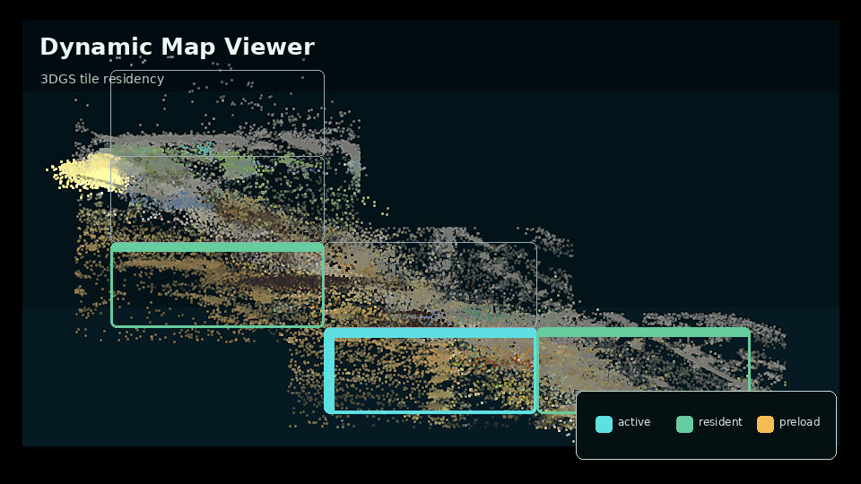

# GS Mapper

[](https://github.com/rsasaki0109/gs-mapper/actions/workflows/ci.yml)
[](LICENSE)
[](https://huggingface.co/spaces/rsasaki0109/gs-mapper)
[](https://colab.research.google.com/github/rsasaki0109/gs-mapper/blob/main/notebooks/photos_to_splat_colab.ipynb)

**Real outdoor robot logs -> browser 3D Gaussian Splats -> Physical AI scenario CI.**

GS Mapper turns photos, rosbags, and external SLAM outputs into browser-viewable
`.splat` scenes. The same scenes can feed route-policy benchmarks and
reviewable scenario CI artifacts.

**Try it first:** [build your own splat — zero install (HF Spaces)](https://huggingface.co/spaces/rsasaki0109/gs-mapper) |
[live 3DGS demo](https://rsasaki0109.github.io/gs-mapper/splat.html) |
[large-scale Dynamic Map Viewer](https://rsasaki0109.github.io/gs-mapper/dreamwalker/?tileCatalog=%2Fmanifests%2Foutdoor-production-grid-large-tile-catalog.json&tilePreload=metadata&tilePreloadLimit=4&tileResidentLimit=6&robotRoute=%2Frobot-routes%2Foutdoor-production-grid-large-route.json&robotRoutePlayback=1&robotRoutePlaybackMs=1200&robotRoutePlaybackLoop=1)

[](https://rsasaki0109.github.io/gs-mapper/)

Lead GIF: dynamic map loading on real robot data — the base layer is a true top-down (orthographic gsplat) render of the Istanbul Bag6 rosbag2 pilot scene, and the resident (green) / preload (amber) tile window moves along the camera trajectory recovered from the mapped street, so 30 m map tiles light up as the camera drives. Standalone still: `docs/images/demo-sweep/dynamic-map-material.png`.

```bash
git clone https://github.com/rsasaki0109/gs-mapper.git
cd gs-mapper
pip install -e ".[dev]"

# Photos -> .splat -> browser viewer
gs-mapper photos-to-splat --images ./my_photos --output outputs/my_splat

# Public 3DGS scenes -> Physical AI scene catalog
python3 scripts/generate_sim_catalog.py --output docs/sim-scenes.json
```

What ships:

- Nine public outdoor `.splat` scenes from supervised GNSS/LiDAR, DUSt3R,
  MAST3R, VGGT-SLAM 2.0, MASt3R-SLAM, and Pi3X.
- Bundled large-scale 3DGS dynamic-map fixture: 9 production outdoor `.splat`
  results composed into a 25-placement regional mosaic with 1.75M Gaussians
  and 87 browser-ready route tiles.
- `photos-to-splat` for image-folder to browser `.splat` runs — also zero-install
  via the HF Spaces and Colab badges above.
- `gs-mapper-live-mapper`: ROS 2 live mapping node — the splat map grows in the
  browser while the robot drives.
- `splat-inspect` and `splat-filter` for cleaning cloudy browser splats.
- Route-policy benchmark and scenario CI tooling for Physical AI review bundles.

## Quickstart — pick your entry point

| What you start with | Minimum command | Deep-dive section |
| --- | --- | --- |
| **A folder of photos** | `gs-mapper photos-to-splat --images ./my_photos --output outputs/my_splat` | [Bring Your Own Photos](#bring-your-own-photos-one-shot-pose-free) |
| **External SLAM artifacts** | `python3 scripts/plan_external_slam_imports.py --format shell` then `gs-mapper preprocess --method external-slam ...` | [Import External SLAM Results](#import-external-slam-results) |
| **Existing splats for policy evaluation** | `python3 scripts/generate_sim_catalog.py --output docs/sim-scenes.json` then `gs-mapper route-policy-benchmark ...` | [Physical AI benchmark path](#physical-ai-benchmark-path) |
| **A live ROS 2 camera topic** | `gs-mapper-live-mapper --image-topic /camera/image_raw/compressed --port 8765` | [Live Mapping (ROS 2)](#live-mapping-ros-2--watch-the-map-grow) |
| **Just a browser** | HF Spaces / Colab badges above | [Zero-install demos](#zero-install-demos-hf-spaces--colab) |

Full rosbag -> supervised outdoor splat is covered in
[Outdoor pipeline quickstart](#outdoor-pipeline-quickstart-autoware-leo-drive).
Generic command examples are in [CLI reference](#cli-reference).

## Live Demo

Pages hosts multiple viewers over the same production scene list:

| URL | Renderer | Use it for |
| --- | --- | --- |
| [`/splat.html`](https://rsasaki0109.github.io/gs-mapper/splat.html) | `antimatter15/splat` WebGL2 | Default lightweight splat viewer |
| [`/splat_spark.html`](https://rsasaki0109.github.io/gs-mapper/splat_spark.html) | Spark 2.0 WebGL2 | Mobile, LoD, and WebXR-capable devices |
| [`/splat_webgpu.html`](https://rsasaki0109.github.io/gs-mapper/splat_webgpu.html) | WebGPU splat viewer | GPU-sort viewer for modern browsers |
| [`/`](https://rsasaki0109.github.io/gs-mapper/) | Three.js point viewer | Landing page and Physical AI proof |

### Large-scale 3DGS Dynamic Map Result

The repo also ships a browser-ready large-scale dynamic-map fixture in
`apps/dreamwalker-web/public/`: 9 production outdoor `.splat` results are
sampled into a 5x5 X/Z regional mosaic, tiled into 87 ready browser splats,
and played back through the Dynamic Map Viewer route UI.

Result media lives in `docs/images/demo-sweep/`: `map-quality.gif` (the
dynamic-map loading GIF, real top-down render), `istanbul-bag6-ortho-base.png`
(its orthographic base layer), `dynamic-map-material.png` (the standalone
still), and `hero.gif` (the older scene-sweep hero).

Open the hosted Dynamic Map Viewer result:

```text
https://rsasaki0109.github.io/gs-mapper/dreamwalker/?tileCatalog=%2Fmanifests%2Foutdoor-production-grid-large-tile-catalog.json&tilePreload=metadata&tilePreloadLimit=4&tileResidentLimit=6&robotRoute=%2Frobot-routes%2Foutdoor-production-grid-large-route.json&robotRoutePlayback=1&robotRoutePlaybackMs=1200&robotRoutePlaybackLoop=1
```

| Result | Value |
| --- | --- |
| Tile catalog | `apps/dreamwalker-web/public/manifests/outdoor-production-grid-large-tile-catalog.json` |
| Route playback | `apps/dreamwalker-web/public/robot-routes/outdoor-production-grid-large-route.json` |
| Source scenes | 9 shipped outdoor production `.splat` results |
| Composite splats | 1,750,000 splats / 56.0 MB generated composite |
| Ready tiles | 87 / 87 ready tiles, 0 missing |
| Tiled splats | 2,698,178 splats including overlap |
| Tiling | `xz`, 8 coordinate-unit tile size, 1.25 overlap |
| Coverage | tile coverage X -95.1 to 92.3 / Z -94.6 to 94.5; rendered route footprint 364.6 x 205.1 |
| Tile bytes | 86.3 MB total across 87 browser tile `.splat` files |
| Runtime view | active / preload / evicted tile residency overlay in Robot Mode |

### Real Rosbag2 3DGS Pilot Result

An Istanbul `rosbag2` capture is also staged as a real-input 3DGS pilot:
291 registered camera frames, GNSS-seeded poses, 100,000 sparse seed points,
6 trained XY source tiles, 6 browser `.splat` files, and 6 transformed viewer
PLY tiles for the Dynamic Map Viewer.



`docs/images/istanbul-bag6-pilot/` also holds the full-resolution result still
(`large-scale-3dgs-result.png`) and the static poster frame
(`dynamic-map-viewer-still.png`).

Open the hosted Dynamic Map Viewer pilot:

```text
https://rsasaki0109.github.io/gs-mapper/dreamwalker/?tileCatalog=%2Fmanifests%2Fistanbul-bag6-pilot-tile-catalog.json&tilePreload=metadata&robotRoute=%2Frobot-routes%2Fistanbul-bag6-pilot-route.json&robotRoutePlayback=1&robotRoutePlaybackMs=1200&robotRoutePlaybackLoop=1
```

| Result | Value |
| --- | --- |
| Tile catalog | `apps/dreamwalker-web/public/manifests/istanbul-bag6-pilot-tile-catalog.json` |
| Route playback | `apps/dreamwalker-web/public/robot-routes/istanbul-bag6-pilot-route.json` |
| Source capture | Istanbul rosbag2, 20.2 s, 3 camera topics, LiDAR, GNSS, TF, IMU |
| Ready tiles | 6 / 6 ready tiles, 0 missing |
| Tile bytes | 12.5 MB total across 6 browser tile `.splat` files |
| Viewer PLY assets | 438,796 Gaussians / 103.8 MiB across 6 transformed viewer tiles |
| Result media | `docs/images/istanbul-bag6-pilot/` (`dynamic-map-viewer.gif`, `large-scale-3dgs-result.png`) |
| Pipeline | `preprocess --method mcd` -> GNSS-seeded COLMAP sparse -> `large-scale-3dgs-run` -> Dynamic Map Viewer promotion |

Run it locally:

```bash
npm --prefix apps/dreamwalker-web run dev -- --host 127.0.0.1 --port 5173
```

Then open:

```text
http://127.0.0.1:5173/?tileCatalog=%2Fmanifests%2Foutdoor-production-grid-large-tile-catalog.json&tilePreload=metadata&tilePreloadLimit=4&tileResidentLimit=6&robotRoute=%2Frobot-routes%2Foutdoor-production-grid-large-route.json&robotRoutePlayback=1&robotRoutePlaybackMs=1200&robotRoutePlaybackLoop=1
```

The scene picker is defined once in `docs/scenes-list.json` and reused by the
viewers, README previews, and GIF scripts.

| Scene | Preview | Pipeline |
|-------|---------|----------|
| Autoware 6-bag fused (supervised default) | [](https://rsasaki0109.github.io/gs-mapper/splat.html?url=assets/outdoor-demo/outdoor-demo.splat) | GNSS + `/tf_static` + LiDAR-seeded COLMAP, image-projected RGB init, gsplat 30-50k iter |
| bag6 cam0 — DUSt3R pose-free | [](https://rsasaki0109.github.io/gs-mapper/splat.html?url=assets/outdoor-demo/outdoor-demo-dust3r.splat) | 20 frames -> DUSt3R pointmap + global align -> gsplat 3k iter |
| MCD tuhh_day_04 — DUSt3R pose-free | [](https://rsasaki0109.github.io/gs-mapper/splat.html?url=assets/outdoor-demo/mcd-tuhh-day04.splat) | 20 MCD handheld frames -> DUSt3R -> gsplat 3k iter |
| bag6 cam0 — MAST3R pose-free (metric) | [](https://rsasaki0109.github.io/gs-mapper/splat.html?url=assets/outdoor-demo/bag6-mast3r.splat) | 20 frames -> MAST3R sparse global alignment -> gsplat 15k iter |
| bag6 cam0 — VGGT-SLAM 2.0 (15k) | [](https://rsasaki0109.github.io/gs-mapper/splat.html?url=assets/outdoor-demo/bag6-vggt-slam-20-15k.splat) | VGGT-SLAM 2.0 artifact import -> gsplat 15k iter |
| bag6 cam0 — MASt3R-SLAM (15k) | [](https://rsasaki0109.github.io/gs-mapper/splat.html?url=assets/outdoor-demo/bag6-mast3r-slam-20-15k.splat) | MASt3R-SLAM artifact import -> gsplat 15k iter |
| bag6 cam0 — Pi3X (15k) | [](https://rsasaki0109.github.io/gs-mapper/splat.html?url=assets/outdoor-demo/bag6-pi3x-20-15k.splat) | Pi3X VO tensor export -> external artifact import -> gsplat 15k iter |
| MCD tuhh_day_04 — MAST3R pose-free (metric) | [](https://rsasaki0109.github.io/gs-mapper/splat.html?url=assets/outdoor-demo/mcd-tuhh-day04-mast3r.splat) | MCD handheld frames -> MAST3R -> gsplat 15k iter |
| MCD ntu_day_02 — supervised | [](https://rsasaki0109.github.io/gs-mapper/splat.html?url=assets/outdoor-demo/mcd-ntu-day02-supervised.splat) | Valid GNSS + ATV calibration + LiDAR-seeded depth-supervised gsplat |

The Autoware supervised default uses the full multi-bag pose-import stack. The MCD supervised row uses `ntu_day_02` because `tuhh_day_04` publishes all-zero GNSS; that rejected zero-GNSS artifact remains documented in `docs/plan_outdoor_gs.md`.

Regenerate preview images after changing a production `.splat`:

```bash
DISPLAY=:0 python3 scripts/capture_readme_splat_previews.py
python3 scripts/build_map_quality_gif.py
```

## Bring Your Own Photos (one-shot, pose-free)

Drop JPG/PNG frames in and get a browser `.splat` out.

```bash
# Optional: clone DUSt3R if you use the DUSt3R backend.
git clone --recursive https://github.com/naver/dust3r /tmp/dust3r

# Quick draft.
gs-mapper photos-to-splat \
  --images ./my_photos \
  --output outputs/my_photos_splat \
  --quality draft

# Cleaner run with stricter export filtering.
gs-mapper photos-to-splat \
  --images ./my_photos \
  --output outputs/my_photos_splat_clean \
  --quality clean \
  --preprocess mast3r
```

Inspect or clean an existing browser `.splat`:

```bash
gs-mapper splat-inspect --input outputs/my_scene.splat

gs-mapper splat-filter \
  --input outputs/my_scene.splat \
  --output outputs/my_scene.clean.splat \
  --min-opacity 0.08 \
  --max-scale-percentile 98
```

Preview locally from the repo root:

```bash
python -m http.server
# open http://localhost:8000/docs/splat.html?url=<path-to-splat>
```

## Zero-install demos (HF Spaces / Colab)

No GPU, no install:

- **[Hugging Face Space](https://huggingface.co/spaces/rsasaki0109/gs-mapper)** —
  upload 8–16 photos or a short walkaround video in the browser and get a
  `.splat` back with an embedded 3D preview. The Space contents live in
  `apps/hf-space/`.
- **[Colab notebook](https://colab.research.google.com/github/rsasaki0109/gs-mapper/blob/main/notebooks/photos_to_splat_colab.ipynb)** —
  the full `photos-to-splat` CLI on a free T4, including a bundled sample photo set.

## Live Mapping (ROS 2) — watch the map grow

`gs-mapper-live-mapper` subscribes to a camera topic (rosbag replay works the
same), gates frames into keyframes, and rebuilds a draft splat in the
background as the robot drives. The bundled polling viewer swaps the growing
map in place without resetting the camera. Full docs: [docs/live-mapping.md](docs/live-mapping.md).


*Real run on KITTI drive 0056 through this exact pipeline: every rebuild round
(DUSt3R + gsplat) extends the mapped street, shown as a top-down orthographic
gsplat render with the recovered camera trajectory in blue and the onboard
camera inset. Reproduce with `scripts/run_live_mapping_demo.py` +
`scripts/build_live_mapping_gif.py`.*

```bash
source /opt/ros/<distro>/setup.bash
gs-mapper-live-mapper \
  --image-topic /camera/image_raw/compressed \
  --odom-topic /odom \
  --port 8765
# status page:  http://localhost:8765/
# live viewer:  docs/splat.html?url=http://localhost:8765/latest.splat&refresh=2
```

No ROS at hand? Replay any image folder as a simulated camera stream:

```bash
python3 scripts/run_live_mapping_demo.py --images ./my_drive_frames --fps 2 --port 8765
```

## Import External SLAM Results

Run heavy front-ends outside this repo, then import their trajectory and points:

```bash
python3 scripts/plan_external_slam_imports.py --format shell

gs-mapper preprocess \
  --method external-slam \
  --images data/my_scene/images \
  --external-slam-trajectory outputs/slam/poses.txt \
  --external-slam-points outputs/slam/map.ply \
  --output outputs/my_scene_sparse
```

Supported profiles include MASt3R-SLAM, VGGT-SLAM 2.0, Pi3/Pi3X, and LoGeR.
The current external-SLAM matrix is in `docs/plan_outdoor_gs.md`.

## Physical AI benchmark path

Use the public splat scenes as versioned simulation inputs:

```bash
python3 scripts/generate_sim_catalog.py --output docs/sim-scenes.json

gs-mapper route-policy-benchmark \
  --policy-registry runs/scenarios/outdoor-policies.json \
  --goal-suite runs/scenarios/outdoor-goals.json \
  --scene-catalog docs/scenes-list.json \
  --scene-id outdoor-demo \
  --episode-count 16 \
  --output runs/scenarios/outdoor-policy-benchmark.json \
  --markdown-output runs/scenarios/outdoor-policy-benchmark.md
```

For matrix, shard, workflow, activation, promotion, adoption, and review-bundle
details, use `docs/physical-ai-sim.md`.

## Outdoor pipeline quickstart (Autoware Leo Drive)

For supervised outdoor reconstruction, use dataset configs and the normal
download -> preprocess -> train -> export chain:

```bash
gs-mapper download --dataset autoware_leo_drive_bag6 --output data/autoware
gs-mapper preprocess --method colmap --data data/autoware --output outputs/autoware_sparse
gs-mapper train --data outputs/autoware_sparse --method gsplat --iterations 30000
gs-mapper export --model outputs/train/point_cloud.ply --format splat --output outputs/autoware.splat
```

For larger routes, bootstrap from the workspace root. This discovers usable
COLMAP sparse outputs, unprocessed rosbags, and existing splat sets, then
writes the first route-contiguous pilot plan when a ready sparse model is
available:

```bash
gs-mapper large-scale-3dgs-bootstrap \
  --root . \
  --pilot-chunks 6
```

For production logs, first gate the staged input root so smoke/demo fixtures do
not get promoted by accident:

```bash
python3 scripts/check_large_scale_3dgs_inputs.py \
  data/large-scale-3dgs-real \
  --output outputs/autoware_large \
  --scene-id autoware-large
```

The real-input staging and Dynamic Map Viewer promotion runbook is
`docs/large-scale-3dgs-real-run.md`.

For manual control, preflight the COLMAP sparse model before launching many
tile jobs:

```bash
gs-mapper large-scale-3dgs-preflight \
  --data outputs/autoware_sparse \
  --output outputs/autoware_large \
  --axes xy \
  --tile-sizes 20,30,50 \
  --target-images-per-chunk 48 \
  --write-pilot \
  --pilot-chunks 6 \
  --write-plan
```

Before committing a full regional run, train the preflight-generated
route-adjacent pilot chunks first:

```bash
gs-mapper large-scale-3dgs-run --plan outputs/autoware_large/large_scale_3dgs_pilot_plan.json
```

When the pilot splats look stable, run the full preflight-generated plan and
promote the trained tiles into Dynamic Map Viewer public assets:

```bash
gs-mapper large-scale-3dgs-run --plan outputs/autoware_large/large_scale_3dgs_plan.json
gs-mapper large-scale-3dgs-promote \
  --plan outputs/autoware_large/large_scale_3dgs_plan.json \
  --run-report outputs/autoware_large/large_scale_3dgs_run_report.json \
  --public-root apps/dreamwalker-web/public \
  --scene-id autoware-large \
  --label "Autoware Large Route"
```

For the bundled large fixture, compose the 9 production splats into a 5x5
regional mosaic and tile that composite:

```bash
python3 scripts/build_large_scale_3dgs_fixture.py
gs-mapper splat-tile-catalog \
  --input outputs/large-scale-3dgs/outdoor-production-grid.splat \
  --output apps/dreamwalker-web/public/manifests/outdoor-production-grid-large-tile-catalog.json \
  --scene-id outdoor-production-grid-large \
  --label "Outdoor Production Regional Mosaic" \
  --tile-size 8 \
  --overlap 1.25 \
  --min-splats 200

gs-mapper large-scale-3dgs-route \
  --catalog apps/dreamwalker-web/public/manifests/outdoor-production-grid-large-tile-catalog.json \
  --output apps/dreamwalker-web/public/robot-routes/outdoor-production-grid-large-route.json \
  --label "Outdoor Production Regional Route" \
  --order snake
```

Open the bundled large-scale viewer entrypoint:

```text
http://localhost:5173/?tileCatalog=%2Fmanifests%2Foutdoor-production-grid-large-tile-catalog.json&tilePreload=metadata&tilePreloadLimit=4&tileResidentLimit=6&robotRoute=%2Frobot-routes%2Foutdoor-production-grid-large-route.json&robotRoutePlayback=1&robotRoutePlaybackMs=1200&robotRoutePlaybackLoop=1
```

For MCD GNSS-seeded runs, first verify non-zero GNSS fixes:

```bash
python3 scripts/check_mcd_gnss.py data/mcd/ntu_day_02 --gnss-topic /vn200/GPS
```

## Installation

```bash
pip install -e ".[dev]"

# Optional backends.
pip install -e ".[gsplat]"
pip install -e ".[nerfstudio]"
pip install -e ".[app]"
```

Streamlit demo:

```bash
streamlit run app.py
```

## CLI reference

```bash
# One-shot photos -> splat.
gs-mapper photos-to-splat --images ./my_photos --output outputs/my_splat

# Step-by-step.
gs-mapper download --dataset mcd --output data/mcd
gs-mapper preprocess --method colmap --data data/mcd --output outputs/sparse
gs-mapper train --data outputs/sparse --method gsplat --iterations 30000
gs-mapper export --model outputs/train/point_cloud.ply --format splat --output outputs/scene.splat

# Generate the Pages scene catalog.
python3 scripts/generate_sim_catalog.py --output docs/sim-scenes.json

# ROS 2 live mapping (see docs/live-mapping.md).
gs-mapper-live-mapper --image-topic /camera/image_raw/compressed --port 8765
```

More command details live in `docs/physical-ai-sim.md`,
`docs/plan_outdoor_gs.md`, and [CONTRIBUTING.md](CONTRIBUTING.md).

## Credits

GS Mapper wraps and interoperates with DUSt3R, MASt3R, MASt3R-SLAM,
VGGT-SLAM 2.0, Pi3/Pi3X, LoGeR, gsplat, nerfstudio, antimatter15/splat,
Spark, and the WebGPU splat viewer. Dataset and upstream licenses still apply;
check each source before commercial use.

## License

MIT. See [LICENSE](LICENSE).
