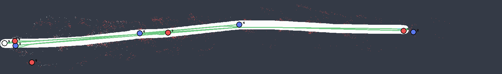
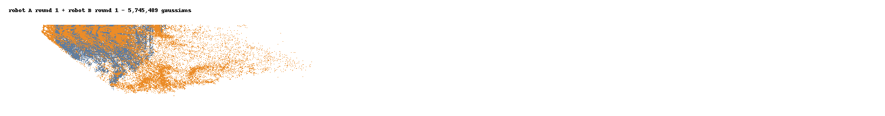
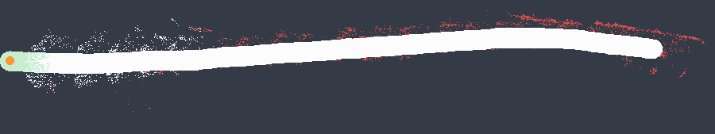
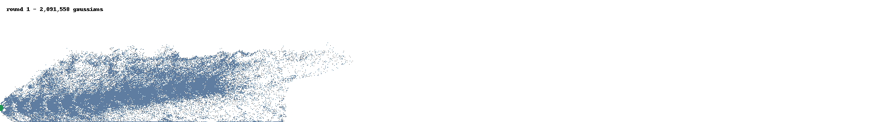
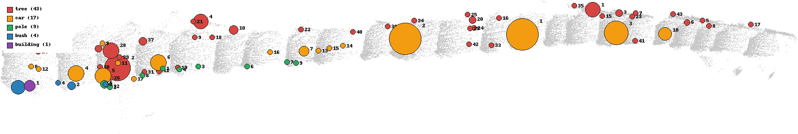
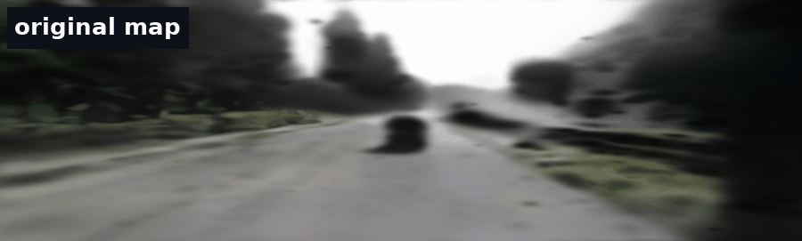
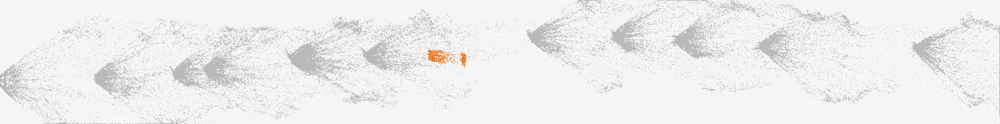
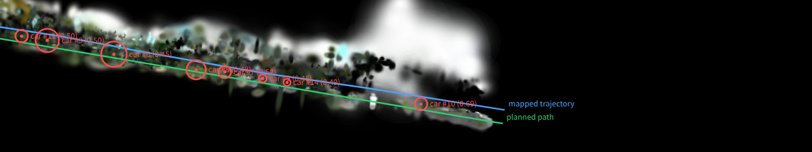
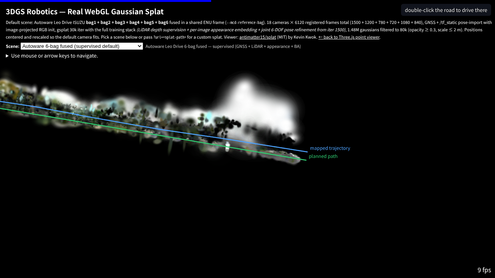

# Live 3DGS Mapping (ROS 2)

Watch the Gaussian-splat map grow in the browser while the robot drives.


*Real KITTI drive 0056 replayed through `scripts/run_live_mapping_demo.py`:
each rebuild round extends the mapped street (top-down orthographic gsplat
render, camera trajectory in blue, onboard camera inset).*

`3dgs-robotics-live-mapper` subscribes to a camera topic, gates incoming frames
into keyframes, and rebuilds a draft-quality splat in a background thread
whenever enough new keyframes arrive. Each round covers the whole trajectory
so far, so the published map grows over time. `live/latest.splat` and
`live/state.json` are replaced atomically, and the bundled polling viewer
swaps the map in place without resetting the camera.

```
camera topic ──> keyframe gate ──> rebuild rounds (DUSt3R / VGGT + gsplat) ──> live/latest.splat
(odom topic)     (time + motion)   whole-run, evenly strided             live/state.json
                                                                            │ HTTP (no-cache)
                                                  browser viewer  <─ poll ──┘
```

## Quickstart (ROS 2)

```bash
source /opt/ros/<distro>/setup.bash
pip install -e ".[gsplat]"   # plus a DUSt3R clone, see below

3dgs-robotics-live-mapper \
  --image-topic /camera/image_raw/compressed \
  --odom-topic /odom \
  --workdir outputs/live_mapping \
  --port 8765
```

Then open `http://localhost:8765/` (status page, links to the polling 3D
viewer) — or the viewer directly:

```
https://rsasaki0109.github.io/3dgs-robotics/splat.html?url=http://localhost:8765/latest.splat&refresh=2
```

Replaying a rosbag through the node works the same way: `ros2 bag play
my_drive` in another terminal. If you only have the bag file, skip ROS
entirely — see the direct replay below.

DUSt3R backend setup matches `photos-to-splat`: clone
[naver/dust3r](https://github.com/naver/dust3r) (`--recursive`) and either set
`DUST3R_PATH` or pass `--dust3r-root`. The checkpoint can be a local `.pth` or
the HF hub id `naver/DUSt3R_ViTLarge_BaseDecoder_512_dpt`
(`--dust3r-checkpoint`). `--method simple` exercises the plumbing without a
checkpoint (non-metric output, smoke tests only).

**VGGT feedforward backend** (`--method vggt`) uses
[facebookresearch/vggt](https://github.com/facebookresearch/vggt). Clone the
repo, set `VGGT_PATH` or pass `--vggt-root`, and optionally `--vggt-checkpoint`
(default hub id `facebook/VGGT-1B`). This is the in-repo one-pass backend — not
the VGGT-SLAM 2.0 external artifact importer.

## Quickstart (no ROS)

Replay any image folder as a simulated camera stream:

```bash
python3 scripts/run_live_mapping_demo.py \
  --images ./my_drive_frames --fps 2 --port 8765
```

Or replay a rosbag directly — no ROS 2 installation required (`pip install
rosbags` is enough; ROS 1 `.bag`, rosbag2 directories, and bare `.db3` /
`.mcap` files all work). Frames are paced by the recorded timestamps
(`--rate 4` plays 4x):

```bash
python3 scripts/run_live_mapping_demo.py \
  --bag ./my_drive_bag --image-topic /camera/image_raw --port 8765
```

When the bag has exactly one image topic, `--image-topic` can be omitted;
otherwise the error message lists the candidates. For a one-shot bag → splat
conversion without the live session, use the CLI instead:

```bash
3dgs-robotics map my_drive_bag/   # works on .bag / .db3 / .mcap too
```

Per-round splats are kept under `<workdir>/rounds/round_*/scene.splat`, which
doubles as an offline timeline for GIF capture. The README GIF above is built
from that timeline:

```bash
python3 scripts/build_live_mapping_gif.py \
  --session outputs/live_mapping_demo \
  --output docs/images/live-mapping/live-mapping-grow.gif
```

Each round is a full pose-free rebuild and therefore lives in its own gauge.
The session aligns every round onto the **session gauge** at runtime (see
below), so the GIF builder simply reuses the persisted
`rounds/round_*/gauge_transform.json` transforms; for legacy sessions without
them it falls back to re-chaining the per-round similarity transforms from the
COLMAP poses.

## Session gauge: the map accumulates instead of jumping

Every rebuild is an independent pose-free reconstruction, so consecutive
rounds disagree in scale / rotation / translation. After each round trains,
the session computes a similarity transform from the keyframes shared with the
previous round (rotation via Kabsch over the shared cameras' orientations —
two shared keyframes suffice — scale/translation from their centers), chains
it onto the first round's gauge, and exports `scene.splat` /
`live/latest.splat` in that fixed **session gauge** with a normalization
frozen on round 1. The polling viewer therefore shows a map that grows
cumulatively rather than re-centering every round. Per-round transforms are
persisted as `rounds/round_NNN/gauge_transform.json` for offline consumers.
If a round shares fewer than 2 keyframes with its predecessor (shouldn't
happen with strided rounds), the chain rebases and the map jumps once instead
of receiving a garbage alignment.

From the third round on, the chain is additionally refined by a **round-level
Sim3 pose graph**: because every rebuild re-strides the whole keyframe
history, temporally distant rounds share keyframes too (including across
revisited places), and every such round pair contributes a direct relative
Sim3 edge weighted by its shared-camera count. A small damped Gauss-Newton
(pure numpy — rounds number in the tens) refines all session-gauge transforms
against those edges, rewrites every round's `gauge_transform.json`
(`"optimized": true`), and the chain continues from the refined latest
transform. This bounds the compounding chain error over long sessions;
drift *inside* one round's pose-free reconstruction is a per-round-backend
matter and is not corrected here. Disable with
`LiveMapperConfig.pose_graph_refinement = False`.

## Loop candidates (revisit detection, v1)

While frames stream in, each accepted keyframe is also matched against older
keyframes (same 64x64 gray-thumbnail metric as motion gating, computed on the
original images so draft map quality doesn't matter). Pairs that are
temporally distant (default ≥ 30 s and ≥ 20 keyframes apart) yet visually
near (default thumbnail diff ≤ 0.04) are recorded as **loop candidates** in
`live/loop_candidates.json` and counted in `state.json`. Map correction
happens at the round level via the pose graph above (shared-keyframe edges);
the candidates themselves are recorded for diagnosis and for future per-pair
re-estimation edges. Judge detection quality on a trajectory plot:

```bash
python3 scripts/plot_loop_candidates.py --session outputs/live_mapping_demo
```

Real loops appear as short edges connecting trajectory segments that pass the
same place; long chords across the map are false positives — raise
`--revisit-min-time-separation` or lower `--revisit-max-distance` (demo
script flags; `LiveMapperConfig.revisit_*` in code).

## Replay a session into rerun

`3dgs-robotics rerun-replay` logs a finished session onto the
[rerun](https://rerun.io) timeline — scrub the `round` timeline and watch the
map grow as colored 3D points (session gauge), the trajectory extend, the
onboard camera update, loop-candidate edges appear, and optionally a
navigation path overlay:

```bash
pip install -e ".[rerun]"
3dgs-robotics rerun-replay --map outputs/live_mapping/session \
  --nav nav/nav_result.json          # writes <map>/rerun/session.rrd
rerun outputs/live_mapping/session/rerun/session.rrd   # or --spawn
```

The `.rrd` file is shareable. Honest note: rerun has no native gaussian-splat
renderer, so the map appears as the gaussian centers (colored point cloud);
distances are camera-height gauge units.

## 3DGS localization

After a live-mapping session finishes, localize query frames against the
final round's trained gaussians (`train/point_cloud.ply`, same gauge as
`images.txt`). Stage 1 picks the nearest mapped keyframe thumbnail; stage 2
refines pose with differentiable gsplat rendering (L1 + SSIM).

Draft maps from the default `--iterations 1500` rebuilds are often too blurry
for tight photometric alignment. For demo-quality localization, retrain the
final round's sparse input at **7k–15k** iterations first:

```bash
# backup the draft map, then retrain round 006 in place
cp outputs/live_demo_kitti0056/session/rounds/round_006/train/point_cloud.ply \
   outputs/live_demo_kitti0056/session/rounds/round_006/train/point_cloud_iter_1500.ply

PYTHONPATH=src 3dgs-robotics train \
  --data outputs/live_demo_kitti0056/session/rounds/round_006/sparse_input \
  --output outputs/live_demo_kitti0056/session/rounds/round_006/train \
  --iterations 10000

# localize non-round keyframes + trajectory GIF
PYTHONPATH=src 3dgs-robotics localize \
  --map outputs/live_demo_kitti0056/session \
  --non-round-keyframes \
  --output /tmp/localization-kitti0056.json

python3 scripts/build_localization_gif.py \
  --session outputs/live_demo_kitti0056/session \
  --output docs/images/live-mapping/localization-kitti0056.gif
```


*Blue: mapped keyframe trajectory. Green: interpolated GT for query frames.
Orange: estimated poses (gauge-relative error in the HUD).*

Evaluation is **gauge-relative** (median spacing between mapped keyframe
centers). Pose-free monocular maps are not metric — do not report meter-level
accuracy.

### ROS 2 localizer node

`3dgs-robotics-localizer` runs the same retrieval + photometric refinement as
a streaming node: camera topic in, `geometry_msgs/PoseStamped` +
`nav_msgs/Path` (and a `map -> camera` TF) out. Localization runs in a
background worker that always takes the newest frame, so a fast camera never
queues up behind the GPU.

```bash
# against a finished session
3dgs-robotics-localizer --map outputs/live_mapping/session \
  --image-topic /camera/image_raw/compressed

# against a session that is still being built by 3dgs-robotics-live-mapper
3dgs-robotics-localizer --map outputs/live_mapping/session --follow-latest
```

| Flag | Default | Meaning |
| --- | --- | --- |
| `--map` | (required) | Live-mapping session directory (the mapper's `--workdir`) |
| `--round` | last successful | Pin one rebuild round |
| `--follow-latest` | off | Reload the map whenever a newer round finishes |
| `--pose-topic` / `--path-topic` | `/gs_localizer/pose` / `/gs_localizer/path` | Outputs (Path for RViz/Foxglove) |
| `--map-frame` / `--camera-frame` | `map` / `camera` | TF frames (`--no-tf` disables the broadcast) |
| `--max-seed-distance` | 0.5 | Reject estimates whose retrieval seed is this far (lost / off-map) |
| `--pyramid-scales` | `0.25,0.5` | Streaming default trades the full-resolution pass for latency |

Poses are in the loaded round's reconstruction gauge (not metric); the camera
frame uses the optical convention (x right, y down, z forward). With
`--follow-latest`, published poses jump to the new round's gauge after each
reload — consumers that need continuity should pin `--round`.

### ROS 2 GS camera simulator node

`3dgs-robotics-camera-sim` is the inverse of the localizer: pose in, rendered
camera topic out. It loads a session round (or any standard 3DGS PLY) and
publishes photorealistic frames with matching `CameraInfo` — a lightweight,
ROS-2-only counterpart to the [Isaac Sim export](isaac-sim.md). Rendering uses
gsplat's CUDA rasterizer when available and a deterministic point-splat
fallback otherwise.

```bash
# virtual camera driven by a PoseStamped topic (e.g. from a planner)
3dgs-robotics-camera-sim --map outputs/live_mapping/session \
  --pose-topic /planner/camera_pose

# self-contained: replay the mapped keyframe trajectory in a loop
3dgs-robotics-camera-sim --map outputs/live_mapping/session --replay --loop
```

| Flag | Default | Meaning |
| --- | --- | --- |
| `--map` / `--ply` | (one required) | Session directory, or a raw 3DGS PLY |
| `--pose-topic` | `/gs_camera_sim/pose` | `PoseStamped` input (map frame, optical-convention camera) |
| `--replay` / `--loop` | off | Replay the session's mapped trajectory instead of subscribing |
| `--image-topic` | `/gs_camera_sim/image_raw/compressed` | `/compressed` suffix selects `CompressedImage`, otherwise raw `rgb8` |
| `--depth-topic` | (off) | Optional `32FC1` depth image output |
| `--gt-pose-topic` | `/gs_camera_sim/gt_pose` | Ground-truth pose published while replaying |
| `--width` / `--height` / `--fov-degrees` | session camera | Render resolution and optics (defaults read `cameras.txt`) |
| `--fps` | 10 | Publish rate |

Closing the loop entirely inside this repo — a virtual camera flies the mapped
trajectory and the localizer re-estimates its poses from pixels alone:

```bash
# terminal 1
3dgs-robotics-camera-sim --map outputs/live_mapping/session --replay --loop

# terminal 2
3dgs-robotics-localizer --map outputs/live_mapping/session \
  --image-topic /gs_camera_sim/image_raw/compressed
```

Compare `/gs_localizer/pose` against `/gs_camera_sim/gt_pose` (both in the
map frame) to measure the loop's accuracy.

### nav2 occupancy grid export

`3dgs-robotics export-grid` projects a session round onto its estimated
ground plane and writes the standard `map.pgm` + `map.yaml` pair that nav2's
`map_server` loads directly (plus a `map.json` sidecar recording the 3D
grid frame):

```bash
3dgs-robotics export-grid --map outputs/live_mapping/session --output nav2_map/map.yaml
ros2 run nav2_map_server map_server --ros-args -p yaml_filename:=nav2_map/map.yaml
```

Pose-free maps have no metric scale, so the export anchors everything to the
**camera height above ground** (estimated from the mapped poses): the
default cell size is 1/20 of it, and `--obstacle-band 0.2,2.0` marks cells
occupied when enough gaussians sit between 0.2 and 2.0 camera-heights above
the estimated ground. Free space comes from ground-level gaussians plus a
swept corridor along the camera trajectory; everything else stays unknown.
Tune `--min-opacity` / `--min-points-per-cell` upward if floaters from a
draft round speckle the map, or retrain the round at higher quality first.
If the map was built with metric poses, the units are metres and the yaml
drops straight into a nav2 bringup.

### Change detection (inspection)

`3dgs-robotics detect-changes` diffs two maps of the same place and reports
what **appeared** and what **disappeared** — two patrols of a route, or two
rebuild rounds of one session:

```bash
# two rounds of one session
3dgs-robotics detect-changes --map-a outputs/session --round-a 5 --round-b 4 \
  --align shared --output changes/changes.json

# two independent sessions of the same place (GPU: aligns by localizing
# map B's keyframes inside map A)
3dgs-robotics detect-changes --map-a outputs/patrol_monday --map-b outputs/patrol_friday \
  --align localize --output changes/changes.json
```

The two gauges are aligned with a Sim3 (shared keyframes when the rounds
overlap, the 3DGS localizer across independent sessions), both gaussian
clouds are voxelized in camera-height units, and solid voxels present in
only one map are clustered into change reports (`changes.json` with
centroids/extents in map A's gauge, plus a top-down `changes.png` preview).
Draft 1500-iteration rounds re-place splats noisily — raise
`--min-cluster-voxels` / `--min-count` (e.g. 25 / 5) to suppress the
speckle, or retrain both rounds at higher quality for fine-grained diffs.

### Inspection patrol (drive to every stop — or to every change)

`3dgs-robotics patrol` drives the simulated robot through a sequence of
stops and optionally captures what it sees at each one (GS render). Stops
come from one of four sources — explicit `--goals "x,y;x,y"`, mapped
`--goal-keyframes`, language `--to "car;traffic sign"`, or, the closed
inspection loop, the clusters of a change report:

```bash
# what changed since the last patrol?
3dgs-robotics detect-changes --map-a run2 --map-b run1 --output changes/changes.json
# ...now GO LOOK at the 8 biggest changes, photograph each, return home
3dgs-robotics patrol --map run2 --from-changes changes/changes.json \
  --change-kinds appeared,disappeared --max-stops 8 --render --return-to-start \
  --gif patrol/patrol.gif --output patrol/patrol_result.json
```



With no waypoint source, the robot visits `--num-waypoints` evenly spaced
mapped keyframes (a route patrol). Unreachable stops are recorded and
skipped, not fatal — a change cluster can sit off the drivable corridor.
Outputs: `patrol_result.json` (per-stop reached/steps/capture paths),
a trace PNG (stops colored by source), per-stop view PNGs with `--render`,
and a stop-view slideshow GIF with `--gif`. The same localizer loop as
`navigate` engages with `--localize-every`; distances are in camera-height
gauge units.

### Merging two maps (collaborative mapping)

`3dgs-robotics merge-maps` fuses two maps of the same place into one splat —
two robots split a route, or a new patrol extends an old map:

```bash
3dgs-robotics merge-maps --map-a outputs/robot1 --map-b outputs/robot2 \
  --align localize --dedup-radius 0.1 --output merged/merged.ply
```

Map B is aligned onto map A's gauge with the same Sim3 machinery as change
detection (`--align shared` for overlapping rounds, `localize` across
independent sessions), its gaussians are transformed at the raw PLY level
(positions, normals, quaternions, log-scales), `--dedup-radius` (camera-height
units) drops B gaussians that duplicate A's coverage, and one merged gsplat
PLY comes out in A's gauge. Caveat: B's spherical-harmonic rest coefficients
are copied unrotated, so after a large gauge rotation its view-dependent
shading is slightly off — `--dc-only` zeroes them for a fully consistent (if
more matte) result.

### Collaborative LIVE mapping (multi-robot merge-live)

`3dgs-robotics merge-live` turns the one-shot merge into a watcher: it polls
two live-mapping sessions' `live/state.json` and, whenever either robot
publishes a new successful round, re-merges the two latest rounds and
atomically replaces `<output>/live/merged.ply` + `<output>/live/latest.splat`
— the same publish contract as a single live session, so the browser viewer's
`?refresh=` polling shows **one map growing from two robots**:

```bash
# robots A and B are live-mapping into their own sessions; merge them live
3dgs-robotics merge-live --map-a outputs/robotA --map-b outputs/robotB \
  --output outputs/combined --dedup-radius 0.1 --interval 5

# one merge and exit (also: --max-merges N, --preview for a colored PNG)
3dgs-robotics merge-live --map-a outputs/robotA --map-b outputs/robotB \
  --output outputs/combined --once --preview
```

The viewer normalization is frozen on the first merge so the combined map does
not re-center as it grows. A failed pair (e.g. a round still being written) is
logged and skipped, not retried in a tight loop. The merged map lives in A's
gauge; everything downstream (`export-grid`, `navigate`, `query-map`) works on
it unchanged. Replay two finished sessions as a concurrent-robots demo with
`python3 scripts/build_live_merge_gif.py --session-a <A> --session-b <B>
--output live_merge.gif`:



### Autonomous navigation in the map

`3dgs-robotics navigate` drives a simulated robot through the map with no
external simulator — the full loop is repo-built parts: A* plans on the
occupancy grid, a pure-pursuit controller follows the path, the GS camera
simulator renders what the robot sees, and the 3DGS localizer closes the
loop. **Control only ever sees the localizer's estimate**, dead-reckoning on
the commanded motion between fixes; the true pose renders the observations.

```bash
# drive from the first mapped keyframe to the last, localizing every 25 steps
3dgs-robotics navigate --map outputs/live_mapping/session \
  --output nav/nav_result.json --gif nav/nav.gif

# pure dead reckoning (no GPU), explicit goal in grid-plane coords
3dgs-robotics navigate --map outputs/live_mapping/session \
  --localize-every 0 --goal 1.8,0.2 --output nav/nav_result.json
```

The simulation injects wheel slip (`--odom-noise`): the true motion deviates
from the commanded one while the estimate dead-reckons on clean commands, so
without fixes the robot drifts off the road — run once with
`--localize-every 0` to see it veer away, then with fixes to see the
localizer pull it back. Accepted fixes pass an innovation gate
(`max_innovation`, rejects visual-aliasing teleports on self-similar
streets) and blend into the estimate (`--fix-blend`). The localizer is most
reliable near mapped keyframe views; between them, fixes are often gated
out — exactly how sparse global fixes behave on a real robot.

Outputs: `nav_result.json` (reached / steps / localization fixes /
cross-track stats), a top-down trace PNG (planned path cyan, driven
trajectory green, fixes orange), and optionally a GIF pairing the robot's
rendered view with the growing trace. Start/goal default to the first/last
mapped keyframes (`--start-keyframe` / `--goal-keyframe` / `--goal x,y`).
Distance knobs (`--robot-radius`, `--speed`, `--goal-tolerance`) are in
camera-height units. The planner keeps the swept mapping trajectory free
even where draft-round floaters mark obstacles — the robot drove there.
The virtual camera follows the local road level (nearest keyframe height),
so sloping streets render correctly.

### Autonomous exploration (the robot picks its own goals)

`3dgs-robotics explore` removes the last human input from the loop: nobody
gives the robot a destination. Starting from a mapped keyframe it raycasts a
visibility scan, finds **frontiers** — the boundary between the space it has
observed and the drivable space it has not — and repeatedly drives to the
most useful frontier (larger and nearer wins) with the same A* + pure-pursuit
stack as `navigate`, until a coverage target over the reachable free space is
met.

```bash
# CPU-only: dead-reckoning exploration with a coverage GIF
3dgs-robotics explore --map outputs/live_mapping/session \
  --output explore/explore_result.json --gif explore/explore.gif

# close the loop with the 3DGS localizer, like navigate
3dgs-robotics explore --map outputs/live_mapping/session \
  --localize-every 25 --odom-noise 0.05 --output explore/explore_result.json
```

Honest framing: the occupancy grid is static, so exploration grows the
robot's **observed region**, not the map data itself — on a real robot the
chosen goals are where you would drive to capture the next mapping frames.
Coverage is measured over free cells reachable from the start (after
robot-radius inflation), so walled-off pockets do not count against the
target. `--sensor-range` is in camera-height units like every other distance
knob.

Outputs: `explore_result.json` (coverage fraction, self-chosen goals with
per-goal coverage, stop reason), a trace PNG (observed space tinted green,
numbered goals orange, remaining frontier yellow), and optionally a GIF
replaying the scans as the observed region sweeps the map. On the KITTI
drive 0056 demo session the robot covers 97.9% of 30k reachable cells with
23 self-chosen goals, CPU-only, in ~2.5 minutes:



### Active mapping (the map grows where the robot decides)

`scripts/run_active_mapping_demo.py` upgrades exploration from "observe a
static map" to **the map itself growing in the direction the robot chooses**.
The loop per round: load the current live map in the session gauge → find
**map frontiers** (drivable space bordering unknown) → drive to the most
useful one with the navigate stack → feed the next batch of recorded frames
to the live mapper → rebuild → verify that the new round actually placed a
keyframe near the chased frontier (otherwise that frontier is marked
exhausted and abandoned):

```bash
python3 scripts/run_active_mapping_demo.py \
  --images ./my_drive_frames --workdir outputs/active_mapping \
  --initial-frames 15 --batch-frames 8 --method vggt --vggt-root /path/to/vggt \
  --gif outputs/active_mapping/active_mapping.gif
```



Honest framing: the capture source is a replay of a recorded drive, not a
real camera controller — the imagery arrives in recorded order. What the
robot genuinely decides is which frontier to chase and whether each rebuild
grew toward it; on a real robot the same goals would steer the platform that
captures the next frames. On KITTI drive 0056, a 15-frame bootstrap map
(2.09M gaussians) grows to 3.05M across 6 self-directed rounds, every chased
frontier confirmed mapped within tolerance (`active_mapping_log.json` keeps
the per-round decisions and frontier distances). All geometry — grids, robot
pose, frontier goals, growth checks — lives in the session gauge via each
round's `gauge_transform.json`, so positions stay comparable as the map
rebuilds.

### Open-vocabulary queries ("where is the car?")

`3dgs-robotics query-map` answers free-text questions about the map:
[CLIPSeg](https://huggingface.co/CIDAS/clipseg-rd64-refined) scores the
mapped keyframe images against the prompt, the per-pixel relevance is lifted
onto the gaussians through the COLMAP poses (occlusion ignored), and
high-scoring gaussians are clustered into ranked 3D hits:

```bash
pip install transformers   # one-time optional dependency
3dgs-robotics query-map "car" --map outputs/live_mapping/session --output query/car.json
```

Outputs `query.json` (hit centroids/extents in the map gauge) and a top-down
preview PNG with the relevance painted red. Each hit carries `goal_xy` in
grid-plane coordinates, and the CLI prints a ready-to-run command — language
in, autonomous driving out:

```bash
3dgs-robotics navigate --map outputs/live_mapping/session --goal <from query-map> \
  --output nav/nav_result.json
```

Or skip the copy-paste entirely — `--to` runs the query and drives to the
best hit in one command:

```bash
3dgs-robotics navigate --map outputs/live_mapping/session --to "car" \
  --output nav/nav_result.json
```

Dynamic objects smear along their motion (a car driving ahead appears as a
chain of hits down the street); lower `--threshold` for fainter concepts and
raise `--min-cluster-gaussians` to suppress speckle.

### Map inventory ("what is in this map?")

`3dgs-robotics inventory` runs the open-vocabulary query over a whole
vocabulary and aggregates the hits into a census — counts, positions, sizes,
scores per category. CLIPSeg loads once and is shared across all prompts:

```bash
3dgs-robotics inventory --map outputs/live_mapping/session \
  --output inventory/inventory.json          # default outdoor vocabulary
# or your own: --vocab "excavator;crane;container" / --vocab-file vocab.txt
```



Outputs `inventory.json` (per-hit centroids/extents/`goal_xy`), a Markdown
report, and the annotated top-down PNG. On the KITTI drive 0056 demo map the
default vocabulary finds 74 clusters (43 trees, 17 cars, 9 poles, 4 bushes,
1 building) in ~2.5 minutes; unmatched prompts are listed as "not found".
Counts depend on the CLIPSeg threshold and draft map quality — a census, not
ground truth. Each hit's `goal_xy` feeds `navigate --goal` and `patrol`
directly, and categories feed `splat-grab`.

### Erasing objects by language ("remove the car")



The same prompt machinery works as an eraser. Dynamic objects are the classic
mapping artifact — a car driving ahead of the rig smears into a ghost streak
along the road. `splat-clean` scores every gaussian against the prompt,
clusters the matches, dilates each cluster to catch the transparent smear
around it, and drops the matching rows from the raw gsplat PLY (every other
attribute survives untouched):

```bash
3dgs-robotics splat-clean "car" --map outputs/live_mapping/session --output clean/no_car.ply
```

Outputs the cleaned `.ply` plus a top-down preview PNG with the removed
gaussians in red. The cleaned map keeps the original gauge, so `navigate`,
`export-grid`, and `merge-maps` keep working against it. Knobs: `--threshold`
(CLIPSeg relevance, default 0.5), `--min-cluster-gaussians` (speckle
suppression), `--dilate` (smear shell in camera-height units, default 0.125).

### Grab & paste objects between maps ("take the car, put it there")

`splat-grab` is splat-clean's complement: the same language selection, but it
KEEPS the matched gaussians as a standalone object splat (plus a `.json`
sidecar recording the source gauge — camera height, up direction, the
object's bottom). By default only the cluster nearest the best query hit is
grabbed, so a moving car sighted along the whole drive doesn't smear into one
giant "object" (`--all-clusters` disables this). `splat-paste` then places
the object into any map: scaled by the camera-height ratio of the two gauges
(maps reconstructed at 1.8x different scales just work), rotated by `--yaw`,
and grounded so the object's bottom lands on the target's road:

```bash
3dgs-robotics splat-grab "car" --map outputs/mapA --output objects/car.ply
3dgs-robotics splat-paste objects/car.ply --map outputs/mapB \
  --at 1.0,0.05 --yaw 45 --output scenes/with_car.ply
```



`--at` uses the same grid-plane coordinates `query-map` returns as `goal_xy`
and `navigate --goal` accepts, so "find a parking spot in map B, paste the
car there" chains directly. Real reconstructed objects become scenario
assets: paste the same object several times to author test scenes for the
Physical AI benchmarks. The merged map keeps the target session's gauge.

### Overlaying robot results in the browser viewer



`export-overlay` projects robot results into the frame of the session's
`scene.splat` (the sim3 gauge chain plus the frozen viewer normalization)
and writes one JSON that the WebGL viewer draws over the gaussians — the
mapped trajectory, the planned navigation path and goal, and the
open-vocabulary query hits, labels included:

```bash
3dgs-robotics export-overlay --map outputs/live_mapping/session \
  --nav nav/nav_result.json --query query/car.json --output overlay/overlay.json
# serve the repo (python3 -m http.server) and open:
#   docs/splat.html?url=<scene.splat url>&overlay=<overlay.json url>
```

`?overlay=` works on the default viewer (`splat.html`) and composes with
`?refresh=` live polling. Rounds rewritten later by pose-graph refinement
can drift slightly against their older splats; the latest round (what the
live viewer shows) always matches.

### Click-to-go (double-click the map, the robot drives there)

`3dgs-robotics-click-to-go` turns the overlay pipeline interactive: it serves
the session (CORS-enabled) and the viewer gains a `?clickgo=<endpoint>` mode —
**double-click anywhere on the road and the robot navigates there**:

```bash
3dgs-robotics-click-to-go --map outputs/live_mapping/session --port 8787
# open the printed viewer URL:
#   splat.html?url=http://localhost:8787/<round>/scene.splat&clickgo=http://localhost:8787
```



The browser unprojects the double-click into a ray in the splat frame and
POSTs it to the server, which inverts the viewer normalization back into the
round gauge, intersects the ray with the mapped ground plane, runs `navigate
--goal` to that point, regenerates the overlay, and returns it — the driven
path appears over the splat a few seconds later, with a status chip showing
"reached the goal in N steps". Clicks beside the drivable corridor are
reported honestly (the planner snaps to the nearest free cell; the run can
end "did not reach"). `--localize-every`/`--odom-noise` pass through to
`navigate`. Coordinates are reconstruction-gauge camera-height units.

The same server is also a hands-on bench for the four 3DGS research axes —
all on the served map, no page reload between them:

```bash
3dgs-robotics-click-to-go --map outputs/live_mapping/session --port 8787 \
  --baseline-round 1          # enables the Dynamic "Diff vs baseline" button
```

- **Semantic** — type a prompt in the search box. The server runs `query-map`
  + `export-overlay` and the open-vocabulary hits come back as 3D wireframe
  boxes drawn over the splat (`POST /query`). **Highlight** goes further and
  recolors the gaussians inside those hit boxes to a bright glow while dimming
  everything else, then hot-swaps the recolored splat in place so the match
  lights up within the map itself (`POST /highlight`).
- **Editable** — **Erase** runs `splat-clean` and **Grab** runs `splat-grab`
  on the same prompt; the cleaned/isolated PLY is re-exported through the
  round's similarity transform and normalization params, so the result lands
  in the exact gauge as the served `scene.splat`. The viewer hot-swaps the new
  splat into its render worker in place — same camera, no reload — so the
  object vanishes (Erase) or floats alone (Grab). **Reset** swaps the original
  splat back, making edits a non-destructive toggle (`POST /clean`, `/grab`).
- **Dynamic** — **Diff vs baseline** runs `detect-changes` between the served
  round (map A) and `--baseline-round` (map B). Clusters that appeared since
  the baseline box in green, ones that disappeared box in orange; because the
  diff report lives in map A's gauge the boxes land on the current splat with
  no swap (`POST /changes`). Without `--baseline-round` the button reports that
  no baseline is configured.
- **Confidence** — **Show confidence** reads the per-gaussian opacity of the
  served `scene.splat` as a reconstruction-confidence score and recolors every
  gaussian on a heatmap (warm = low confidence, cool = high), pinning the alpha
  to a readable constant so under-reconstructed regions glow red. It needs no
  query and no CLI — the recolor is computed straight from the served splat and
  hot-swapped in place, and the status line reports how many low-confidence
  gaussians remain (`POST /quality`).

One server backs the lot: `/query`, `/highlight`, `/clean`, `/grab`,
`/changes`, `/quality`, and `/goal`.

## How rounds are scheduled

| Knob | Default | Meaning |
| --- | --- | --- |
| `--min-keyframe-gap` | 1.0 s | Minimum time between keyframes |
| `--min-keyframe-motion` | 0.04 | Minimum gray-thumbnail diff (0..1) when no odometry |
| `--min-translation` | 0.5 m | Minimum odometry translation between keyframes |
| `--rebuild-min-new` | 4 | New keyframes required to trigger a rebuild round |
| `--num-frames` | 24 | Frame cap per round (evenly strided over the whole run) |
| `--iterations` | 1500 | gsplat iterations per round (draft latency over fidelity) |
| `--align-iters` | 150 | DUSt3R global alignment iterations per round (ignored for `--method vggt`) |
| `--scene-graph` | `swin-3` | Pair graph; sequential streams want `swin-N` (DUSt3R/MAST3R only) |
| `--method` | `dust3r` | Pose-free backend: `dust3r`, `mast3r`, `vggt`, or `simple` |
| `--max-keyframes` | 512 | Hard cap on stored keyframes |

Each round is a full draft rebuild over a strided snapshot of the run — an
intentionally simple contract (no warm-start state to corrupt, bounded round
time via `--num-frames`). On a 16 GB RTX 4070 Ti SUPER a 24-frame round takes
roughly 2–4 minutes with DUSt3R preprocess + 1500 gsplat iterations; the same
round with `--method vggt` is typically **~30–90 seconds for preprocess**
(feedforward, no global alignment) plus training time. Lower `--num-frames` /
`--iterations` for faster rounds, raise them for cleaner maps.

## Outputs

```
<workdir>/
  keyframes/kf_000042.jpg     accepted keyframes
  rounds/round_003/           per-round sparse + train + scene.splat
  rounds/round_003/gauge_transform.json  round gauge -> session gauge (Sim3)
  live/latest.splat           atomically replaced after each round (session gauge)
  live/state.json             keyframe/round/loop counters for viewers
  live/loop_candidates.json   revisit detections (diagnosis; correction = round pose graph)
  live/index.html             status page (copy of docs/splat_live.html)
```

`state.json` schema (consumed by `docs/splat_live.html` and the
`?refresh=` mode of `docs/splat.html`):

```json
{
  "status": "building",
  "keyframesTotal": 42,
  "completedRounds": 5,
  "lastSuccessfulRound": {"round": 5, "keyframesUsed": 24, "buildSeconds": 131.2},
  "loopCandidates": 3,
  "splatUrl": "latest.splat"
}
```

## Testing

The session core (`gs_sim2real/robotics/live_mapping.py`) is rclpy-free;
`tests/test_live_mapping.py` and `tests/test_live_mapper_node.py` cover
keyframe gating, round scheduling, failure recovery, and message decoding
without a GPU or a ROS installation.
