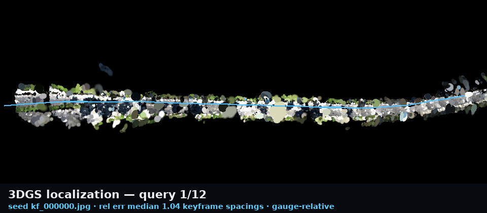

# Live 3DGS Mapping (ROS 2)

Watch the Gaussian-splat map grow in the browser while the robot drives.


*Real KITTI drive 0056 replayed through `scripts/run_live_mapping_demo.py`:
each rebuild round extends the mapped street (top-down orthographic gsplat
render, camera trajectory in blue, onboard camera inset).*

`3dgs-robotics-live-mapper` subscribes to a camera topic, gates incoming frames
into keyframes, and rebuilds a draft-quality splat in a background thread
whenever enough new keyframes arrive. Each round covers the whole trajectory
so far, so the published map grows over time. `live/latest.splat` and
`live/state.json` are replaced atomically, and the bundled polling viewer
swaps the map in place without resetting the camera.

```
camera topic ──> keyframe gate ──> rebuild rounds (DUSt3R / VGGT + gsplat) ──> live/latest.splat
(odom topic)     (time + motion)   whole-run, evenly strided             live/state.json
                                                                            │ HTTP (no-cache)
                                                  browser viewer  <─ poll ──┘
```

## Quickstart (ROS 2)

```bash
source /opt/ros/<distro>/setup.bash
pip install -e ".[gsplat]"   # plus a DUSt3R clone, see below

3dgs-robotics-live-mapper \
  --image-topic /camera/image_raw/compressed \
  --odom-topic /odom \
  --workdir outputs/live_mapping \
  --port 8765
```

Then open `http://localhost:8765/` (status page, links to the polling 3D
viewer) — or the viewer directly:

```
https://rsasaki0109.github.io/3dgs-robotics/splat.html?url=http://localhost:8765/latest.splat&refresh=2
```

Replaying a rosbag through the node works the same way: `ros2 bag play
my_drive` in another terminal. If you only have the bag file, skip ROS
entirely — see the direct replay below.

DUSt3R backend setup matches `photos-to-splat`: clone
[naver/dust3r](https://github.com/naver/dust3r) (`--recursive`) and either set
`DUST3R_PATH` or pass `--dust3r-root`. The checkpoint can be a local `.pth` or
the HF hub id `naver/DUSt3R_ViTLarge_BaseDecoder_512_dpt`
(`--dust3r-checkpoint`). `--method simple` exercises the plumbing without a
checkpoint (non-metric output, smoke tests only).

**VGGT feedforward backend** (`--method vggt`) uses
[facebookresearch/vggt](https://github.com/facebookresearch/vggt). Clone the
repo, set `VGGT_PATH` or pass `--vggt-root`, and optionally `--vggt-checkpoint`
(default hub id `facebook/VGGT-1B`). This is the in-repo one-pass backend — not
the VGGT-SLAM 2.0 external artifact importer.

## Quickstart (no ROS)

Replay any image folder as a simulated camera stream:

```bash
python3 scripts/run_live_mapping_demo.py \
  --images ./my_drive_frames --fps 2 --port 8765
```

Or replay a rosbag directly — no ROS 2 installation required (`pip install
rosbags` is enough; ROS 1 `.bag`, rosbag2 directories, and bare `.db3` /
`.mcap` files all work). Frames are paced by the recorded timestamps
(`--rate 4` plays 4x):

```bash
python3 scripts/run_live_mapping_demo.py \
  --bag ./my_drive_bag --image-topic /camera/image_raw --port 8765
```

When the bag has exactly one image topic, `--image-topic` can be omitted;
otherwise the error message lists the candidates. For a one-shot bag → splat
conversion without the live session, use the CLI instead:

```bash
3dgs-robotics map my_drive_bag/   # works on .bag / .db3 / .mcap too
```

Per-round splats are kept under `<workdir>/rounds/round_*/scene.splat`, which
doubles as an offline timeline for GIF capture. The README GIF above is built
from that timeline:

```bash
python3 scripts/build_live_mapping_gif.py \
  --session outputs/live_mapping_demo \
  --output docs/images/live-mapping/live-mapping-grow.gif
```

Each round is a full pose-free rebuild and therefore lives in its own gauge.
The session aligns every round onto the **session gauge** at runtime (see
below), so the GIF builder simply reuses the persisted
`rounds/round_*/gauge_transform.json` transforms; for legacy sessions without
them it falls back to re-chaining the per-round similarity transforms from the
COLMAP poses.

## Session gauge: the map accumulates instead of jumping

Every rebuild is an independent pose-free reconstruction, so consecutive
rounds disagree in scale / rotation / translation. After each round trains,
the session computes a similarity transform from the keyframes shared with the
previous round (rotation via Kabsch over the shared cameras' orientations —
two shared keyframes suffice — scale/translation from their centers), chains
it onto the first round's gauge, and exports `scene.splat` /
`live/latest.splat` in that fixed **session gauge** with a normalization
frozen on round 1. The polling viewer therefore shows a map that grows
cumulatively rather than re-centering every round. Per-round transforms are
persisted as `rounds/round_NNN/gauge_transform.json` for offline consumers.
If a round shares fewer than 2 keyframes with its predecessor (shouldn't
happen with strided rounds), the chain rebases and the map jumps once instead
of receiving a garbage alignment.

From the third round on, the chain is additionally refined by a **round-level
Sim3 pose graph**: because every rebuild re-strides the whole keyframe
history, temporally distant rounds share keyframes too (including across
revisited places), and every such round pair contributes a direct relative
Sim3 edge weighted by its shared-camera count. A small damped Gauss-Newton
(pure numpy — rounds number in the tens) refines all session-gauge transforms
against those edges, rewrites every round's `gauge_transform.json`
(`"optimized": true`), and the chain continues from the refined latest
transform. This bounds the compounding chain error over long sessions;
drift *inside* one round's pose-free reconstruction is a per-round-backend
matter and is not corrected here. Disable with
`LiveMapperConfig.pose_graph_refinement = False`.

## Loop candidates (revisit detection, v1)

While frames stream in, each accepted keyframe is also matched against older
keyframes (same 64x64 gray-thumbnail metric as motion gating, computed on the
original images so draft map quality doesn't matter). Pairs that are
temporally distant (default ≥ 30 s and ≥ 20 keyframes apart) yet visually
near (default thumbnail diff ≤ 0.04) are recorded as **loop candidates** in
`live/loop_candidates.json` and counted in `state.json`. Map correction
happens at the round level via the pose graph above (shared-keyframe edges);
the candidates themselves are recorded for diagnosis and for future per-pair
re-estimation edges. Judge detection quality on a trajectory plot:

```bash
python3 scripts/plot_loop_candidates.py --session outputs/live_mapping_demo
```

Real loops appear as short edges connecting trajectory segments that pass the
same place; long chords across the map are false positives — raise
`--revisit-min-time-separation` or lower `--revisit-max-distance` (demo
script flags; `LiveMapperConfig.revisit_*` in code).

## 3DGS localization

After a live-mapping session finishes, localize query frames against the
final round's trained gaussians (`train/point_cloud.ply`, same gauge as
`images.txt`). Stage 1 picks the nearest mapped keyframe thumbnail; stage 2
refines pose with differentiable gsplat rendering (L1 + SSIM).

Draft maps from the default `--iterations 1500` rebuilds are often too blurry
for tight photometric alignment. For demo-quality localization, retrain the
final round's sparse input at **7k–15k** iterations first:

```bash
# backup the draft map, then retrain round 006 in place
cp outputs/live_demo_kitti0056/session/rounds/round_006/train/point_cloud.ply \
   outputs/live_demo_kitti0056/session/rounds/round_006/train/point_cloud_iter_1500.ply

PYTHONPATH=src 3dgs-robotics train \
  --data outputs/live_demo_kitti0056/session/rounds/round_006/sparse_input \
  --output outputs/live_demo_kitti0056/session/rounds/round_006/train \
  --iterations 10000

# localize non-round keyframes + trajectory GIF
PYTHONPATH=src 3dgs-robotics localize \
  --map outputs/live_demo_kitti0056/session \
  --non-round-keyframes \
  --output /tmp/localization-kitti0056.json

python3 scripts/build_localization_gif.py \
  --session outputs/live_demo_kitti0056/session \
  --output docs/images/live-mapping/localization-kitti0056.gif
```



*Blue: mapped keyframe trajectory. Green: interpolated GT for query frames.
Orange: estimated poses (gauge-relative error in the HUD).*

Evaluation is **gauge-relative** (median spacing between mapped keyframe
centers). Pose-free monocular maps are not metric — do not report meter-level
accuracy.

## How rounds are scheduled

| Knob | Default | Meaning |
| --- | --- | --- |
| `--min-keyframe-gap` | 1.0 s | Minimum time between keyframes |
| `--min-keyframe-motion` | 0.04 | Minimum gray-thumbnail diff (0..1) when no odometry |
| `--min-translation` | 0.5 m | Minimum odometry translation between keyframes |
| `--rebuild-min-new` | 4 | New keyframes required to trigger a rebuild round |
| `--num-frames` | 24 | Frame cap per round (evenly strided over the whole run) |
| `--iterations` | 1500 | gsplat iterations per round (draft latency over fidelity) |
| `--align-iters` | 150 | DUSt3R global alignment iterations per round (ignored for `--method vggt`) |
| `--scene-graph` | `swin-3` | Pair graph; sequential streams want `swin-N` (DUSt3R/MAST3R only) |
| `--method` | `dust3r` | Pose-free backend: `dust3r`, `mast3r`, `vggt`, or `simple` |
| `--max-keyframes` | 512 | Hard cap on stored keyframes |

Each round is a full draft rebuild over a strided snapshot of the run — an
intentionally simple contract (no warm-start state to corrupt, bounded round
time via `--num-frames`). On a 16 GB RTX 4070 Ti SUPER a 24-frame round takes
roughly 2–4 minutes with DUSt3R preprocess + 1500 gsplat iterations; the same
round with `--method vggt` is typically **~30–90 seconds for preprocess**
(feedforward, no global alignment) plus training time. Lower `--num-frames` /
`--iterations` for faster rounds, raise them for cleaner maps.

## Outputs

```
<workdir>/
  keyframes/kf_000042.jpg     accepted keyframes
  rounds/round_003/           per-round sparse + train + scene.splat
  rounds/round_003/gauge_transform.json  round gauge -> session gauge (Sim3)
  live/latest.splat           atomically replaced after each round (session gauge)
  live/state.json             keyframe/round/loop counters for viewers
  live/loop_candidates.json   revisit detections (diagnosis; correction = round pose graph)
  live/index.html             status page (copy of docs/splat_live.html)
```

`state.json` schema (consumed by `docs/splat_live.html` and the
`?refresh=` mode of `docs/splat.html`):

```json
{
  "status": "building",
  "keyframesTotal": 42,
  "completedRounds": 5,
  "lastSuccessfulRound": {"round": 5, "keyframesUsed": 24, "buildSeconds": 131.2},
  "loopCandidates": 3,
  "splatUrl": "latest.splat"
}
```

## Testing

The session core (`gs_sim2real/robotics/live_mapping.py`) is rclpy-free;
`tests/test_live_mapping.py` and `tests/test_live_mapper_node.py` cover
keyframe gating, round scheduling, failure recovery, and message decoding
without a GPU or a ROS installation.
